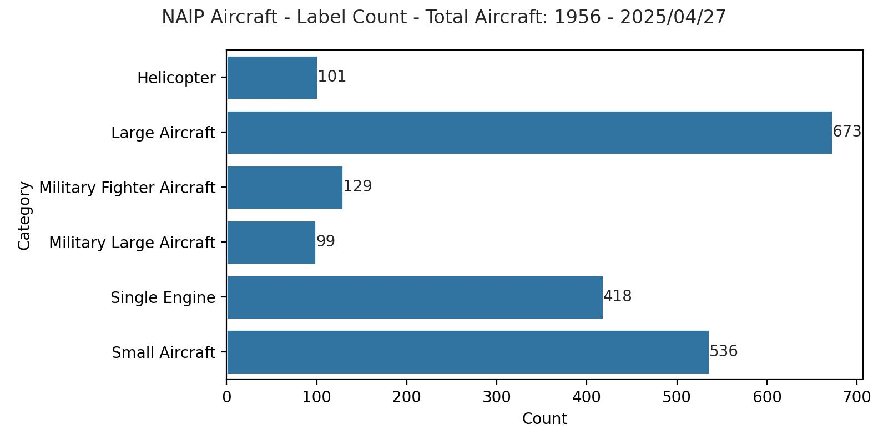

 

[![CC BY 4.0][cc-by-shield]][cc-by]

# 🛫 NAIP Aircraft
Comprehensive NAIP-derived dataset for aircraft detection use cases using machine learning.

> [!IMPORTANT]
> This dataset is currently under construction. Contributors are welcome.

## Why?
NAIP is a USA-wide high resolution aerial dataset with excellent image quality and detail. NAIP imagery included in the dataset has a GSD of at least 0.6m and is free from cloud or other effects. Many images in this dataset have a GSD of 0.3m. All NAIP imagery in this dataset have red, green, blue, and NIR bands.

Current [public datasets](https://www.kaggle.com/datasets/airbusgeo/airbus-aircrafts-sample-dataset/) for aircraft detection are coarse and lack detailed labels. This makes detection of the _type_ of aircraft difficult.

Due to NAIP's extensive coverage throughout the United States, it is a very rich dataset across many different environments.

## Goals
At the end of this project I aim to have the following:
- First-pass labeling via trained object detection model
- Automated releases and PR linting/input data validation
- The dataset up on huggingface w/ an example model available
- Notebooks available on how to download the imagery and use it (model trainig/inference)
- Github Pages for project

**Stretch Goals:**
- Add albumentations & modifications to make it more like satellite imagery
- Build more world-wide datasets like this

## Dataset Features

Each NAIP image bounding box contains the following features:
- **category** (int): Label class, see [Label Classes](#label-classes)
- **obstructed** (bool): True if part of the aircraft is obstructed by buildings/hangars/tile edges
- **notes** (str): Any notes about aircraft, usually empty. 

### Label Classes
| Example | Label Value | Label Name | Details |
| ------- | ----------- | ---------- | ------- |
|  | 0 | Single Engine | Small, single-engine, hobby planes. Cessna 172, etc. |
|  | 1 | Small Aircraft | Most varied class. Beachcraft Baron to private jets to commuter aircraft (ERJs) |
|  | 2 | Large Aircraft | Any wide or narrow body commercial aircraft with under-wing engines |
|  | 3 | Large Military Aircraft | Any clearly military aircraft larger than single/two-seater fighters |
|  | 4 | Fighter Military Aircraft | Small military fighter aircraft |
|  | 5 | Helicopter | Any single or dual rotor helicopter |

These label classes are a rough first pass and definitely need continued massaging, improvement, and definition.

## Contributing
Please help me! I think I've already given myself carpal tunnel from hand labeling what we have so far. Contributing guide coming soon.

# License
This work is licensed under a
[Creative Commons Attribution 4.0 International License][cc-by].

[cc-by]: http://creativecommons.org/licenses/by/4.0/
[cc-by-image]: https://i.creativecommons.org/l/by/4.0/88x31.png
[cc-by-shield]: https://img.shields.io/badge/License-CC%20BY%204.0-lightgrey.svg
